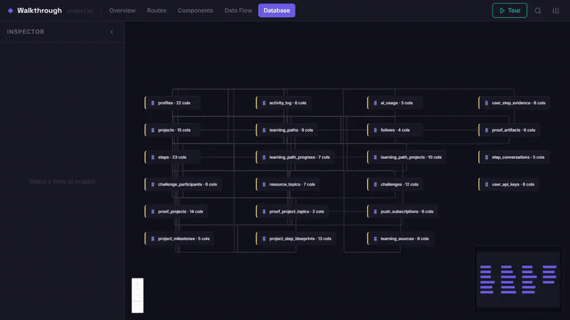
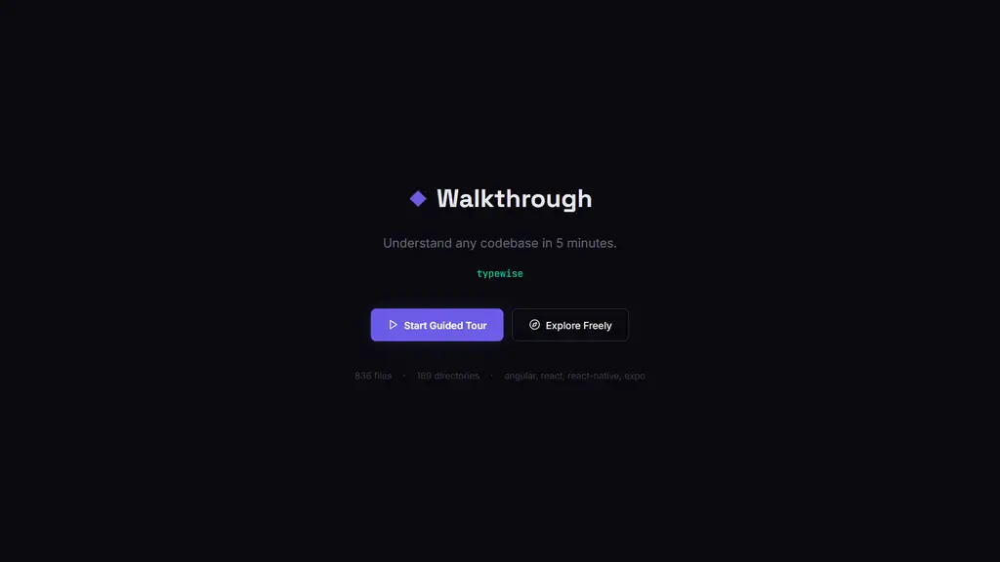
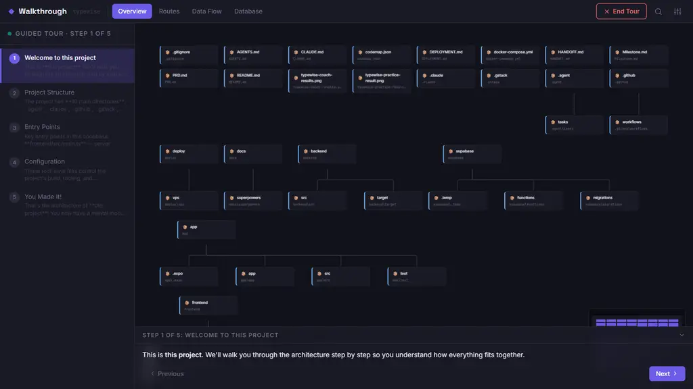
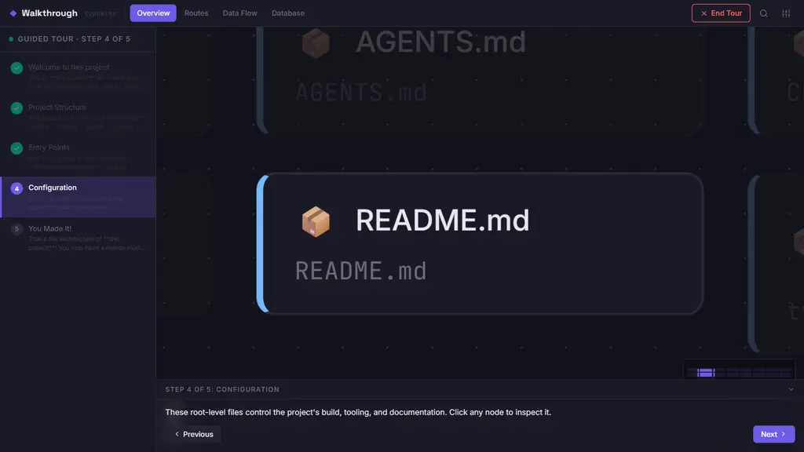

# ◆ Walkthrough

**Find your way into an unfamiliar codebase.**

Walkthrough scans a local checkout and shows its docs, manifests, tests, source roots, likely entry files, and file search. Open a file in the read-only preview, or explore the existing architecture map and tour. Language-specific analysis adds routes, components, and database views when supported.

```bash
npx walkthrough-cli ./path/to/your/project
```

*(until the npm publish lands: `npx github:kyooosukedn/walkthrough`)*

Your browser opens to a repo orientation screen. Pick a real file or search by path. The architecture tour remains available as an optional view.

To get a guided explanation of a file, configure a DeepSeek API key in the terminal that starts Walkthrough:

```bash
export DEEPSEEK_API_KEY=your-key
npx walkthrough-cli ./path/to/your/project
```

In PowerShell, use `$env:DEEPSEEK_API_KEY = "your-key"`. The default model is `deepseek-flash`; set `DEEPSEEK_MODEL` to another supported DeepSeek model if needed. Open a file and click **Explain this file**. The CLI then sends up to six scanned, non-secret source files (48,000 characters total) to DeepSeek. Scanning and ordinary preview make no AI request. The explanation cites files and lines you can open beside it. TypeScript/JavaScript import links may add relevant files; Python, Go, Rust, and other languages fall back to the selected file, matching test, and nearby documentation when found. AI explanations can be wrong; check the cited code.


*(Real run: a 573-file Next.js + Supabase project scanned in ~1.5 s — welcome, guided tour, then Routes / Components / Database views.)*

Still frames:

| Welcome | Tour start | Mid-tour |
|---|---|---|
|  |  |  |

*(Scanned project: a real 836-file / 131k-LOC Expo + legacy-Java codebase, 1.3 s scan.)*

You've been there: first day on a codebase, 200 files, no map. READMEs describe what the product does, not how the code is shaped. Dependency graphs show everything and explain nothing.

Walkthrough is the tool I wished existed when opening an unfamiliar codebase for the first time. It's built for **humans learning a codebase** — onboarding, taking over a project, evaluating a repo before contributing.

## How it works

```
You run:  walkthrough ./my-project
              ↓
Scanner reads your codebase (file tree, imports, entry points,
framework detection — static file analysis, no execution)
              ↓
Generates codemap.json (pure data — the contract)
              ↓
Opens browser → interactive React app loads the blueprint
              ↓
Guided animated tour walks you through the architecture
```

Three packages, one contract:

- **`@walkthrough/scanner`** — scans a codebase and emits `codemap.json`. Usable standalone in CI or scripts.
- **`@walkthrough/visualizer`** — data-driven React app (React Flow + elkjs). Renders any valid `codemap.json`, even hand-written.
- **`walkthrough-cli`** — wires them together and serves a contained, read-only source preview on loopback. One command, browser opens.

The scanner and visualizer never speak directly. The JSON is the entire contract — versioned, progressive (a minimal file-tree-only map is valid), schema-typed on both sides.

## Performance

Single-threaded Node, no cache, cold start included (Windows 11, Ryzen 7 5700U):

| Project | Files | Lines | Scan time |
|---|---|---|---|
| Small Next.js app | 69 | 2,560 | 363 ms |
| Go codebase | 224 | 52,190 | 483 ms |
| Expo + legacy Java monorepo | 836 | 131,118 | 1,279 ms |

~1.5 s for 131k LOC. Import resolution handles relative paths, tsconfig `paths` aliases (`@/`-style, including commented JSONC tsconfigs), `export … from`, side-effect and dynamic imports.

## What works today (v0.1)

- [x] Universal repo orientation: docs, manifests, tests, source roots, and filename search
- [x] Read-only preview of scanned UTF-8 files on the local CLI server
- [x] On-demand AI explanation beside code, with validated source citations
- [x] Conventional Python, Go, and Rust entry-file suggestions
- [x] Routes view (Next.js App Router + Pages Router analyzers)
- [x] Component tree view (React analyzer: PascalCase exports, pages, who-imports-whom)
- [x] Database schema view (Prisma models + SQL migrations: tables, columns, FK relations, ER overview)
- [x] Entry-point detection
- [x] Framework detection (Next.js, React, Angular, Vue, SvelteKit, Expo, React Native, NestJS, Nuxt, Astro, Express, Fastify, Hono, Vite)
- [x] Auto-generated guided tour with narration, camera moves, animated edges
- [x] System overview view + free explore mode
- [x] Served locally by the CLI; `--json` / `--no-serve` for scripting

## What's next (in public)
- [x] Express routes analyzer *(shipped — merged into Routes view)*
- [ ] Code-splitting the visualizer bundle (currently 1.86 MB)
- [ ] npm publish (`npx walkthrough`)

This repo is built in the open. See [DECISIONS.md](./DECISIONS.md) for the tradeoffs and rejected alternatives behind the current shape.

For a source-level tour of the current implementation, see [Codebase guide](./docs/CODEBASE_GUIDE.md). [ARCHITECTURE.md](./ARCHITECTURE.md) is an earlier design proposal; it describes capabilities that have not all shipped.

## Development

```bash
git clone https://github.com/kyooosukedn/walkthrough
cd walkthrough
npm install
npm run build
npm test
node packages/cli/dist/index.js ./some-project
```

## License

MIT
